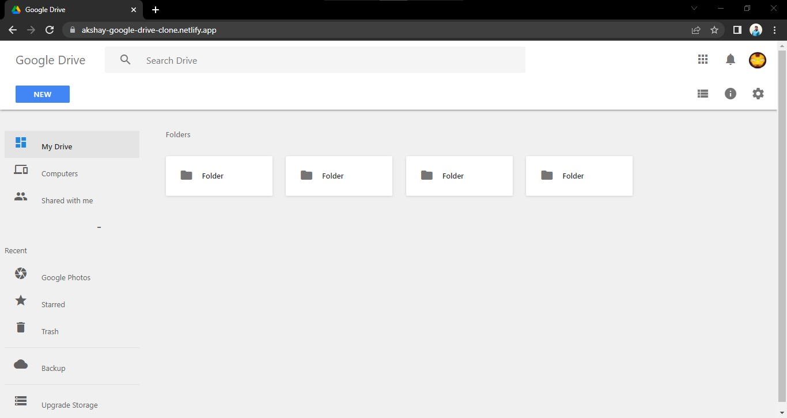

# Google Drive — Minimal Front-end Clone

A small, single-page front-end clone inspired by Google Drive. Built for learning and demo purposes only.

Creator: Dhaval Lalwani

<!-- Badges -->

## Table of contents

- [Google Drive — Minimal Front-end Clone](#google-drive--minimal-front-end-clone)
  - [Table of contents](#table-of-contents)
  - [About](#about)
  - [Preview](#preview)
  - [🔗 Other Links](#-other-links)
  - [Feedback](#feedback)
  - 
  - [How to view locally](#how-to-view-locally)
  - [Files of interest](#files-of-interest)
  - [Credits \& License](#credits--license)

## About

- A clean HTML/CSS mock of the Google Drive UI.
- Static assets (icons, images, styles) are included in this repo.

## Preview

The screenshot above is included in `images/Screenshot.jpg`. You can replace it with your own to update the preview.

## 🔗 Other Links

## Feedback

If you have any feedback, please reach out to me at

 

##

## How to view locally

This is a static site — open `index.html` in your browser.

## Files of interest

- `index.html` — main markup
- `CSS/style.css` — styles
- `images/` — screenshots and example assets

## Credits & License

This project is not affiliated with Google. It's a personal learning project by Dhaval Lalwani.

Licensed under the MIT License — see the `LICENSE` file for details.
